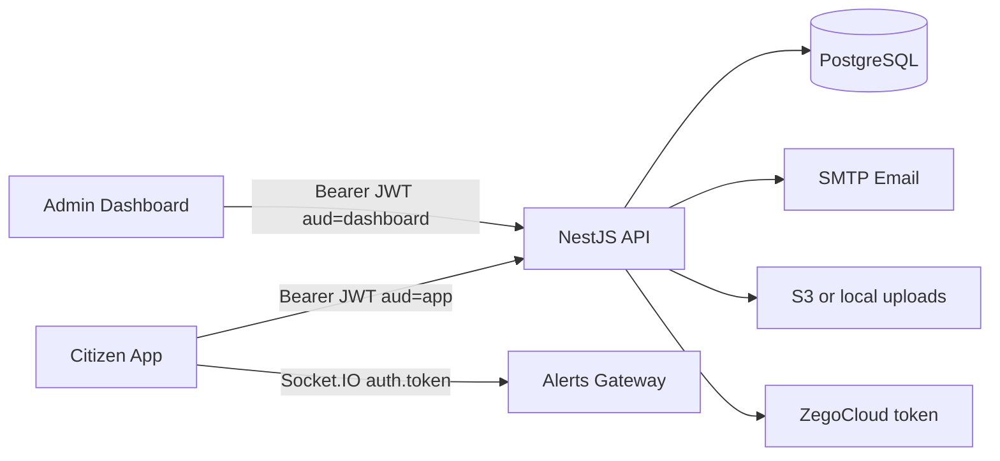
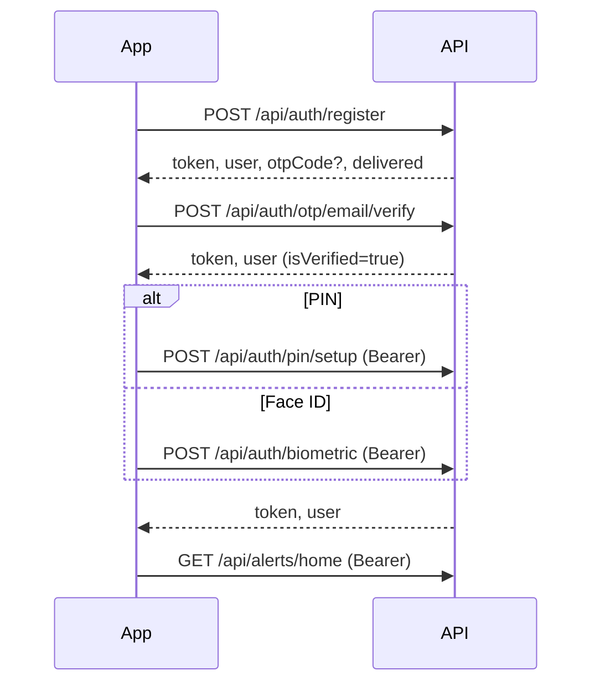
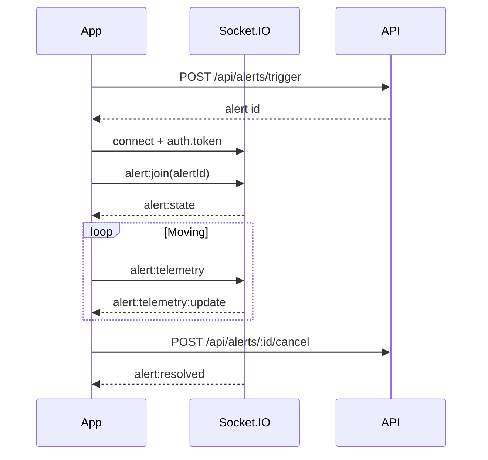

# Safety Circle — App Developer Integration Guide

**Safety Circle** is a real-time emergency response platform. Citizens use a mobile (or web) app to register, manage trusted contacts/groups, trigger SOS alerts with live location and chat, and receive notifications. A separate **Super Admin** web dashboard monitors incidents, users, catalogs, and legal content.

This README is the **primary technical integration guide for the App Development team**. It documents the **actual NestJS backend contracts** so you can integrate without repeatedly reading backend source.

| Resource | URL (local Docker defaults) |
|---|---|
| REST API + Socket.IO | `http://localhost:5000` |
| Swagger UI | `http://localhost:5000/api/docs` |
| Health check | `http://localhost:5000/health` |
| Admin web dashboard | `http://localhost:3000` |

> **Source of truth:** NestJS controllers under `backend/src`. Live OpenAPI at `/api/docs` may lag slightly behind auth routes added for email OTP / biometric login — prefer this README for those.

---

## Table of contents

1. [Project overview](#1-project-overview)
2. [Technology stack](#2-technology-stack)
3. [System architecture](#3-system-architecture)
4. [App developer quick start](#4-app-developer-quick-start)
5. [Conventions (base URL, headers, envelopes)](#5-conventions)
6. [Authentication & authorization](#6-authentication--authorization)
7. [Complete application flows](#7-complete-application-flows)
8. [API integration sequences](#8-api-integration-sequences)
9. [Citizen API reference](#9-citizen-api-reference)
10. [Admin / Super Admin API reference](#10-admin--super-admin-api-reference)
11. [Real-time (Socket.IO)](#11-real-time-socketio)
12. [File / image upload](#12-file--image-upload)
13. [Third-party integrations](#13-third-party-integrations)
14. [Data models (App-relevant)](#14-data-models-app-relevant)
15. [Error handling](#15-error-handling)
16. [Environment & local setup](#16-environment--local-setup)
17. [Known limitations & simulated behavior](#17-known-limitations--simulated-behavior)

---

## 1. Project overview

### What the product does

Safety Circle lets a citizen:

- Create an account (email required, phone optional)
- Verify email via 6-digit OTP
- Secure the account with a **4-digit PIN** and/or **Face ID** (at least one required before login)
- Manage emergency contacts and groups (plan-limited)
- Trigger SOS / emergency / silent / test alerts with location
- Share live telemetry, chat, and (when configured) ZegoCloud A/V rooms with responders
- Manage profile, journals, notifications, and subscription tier

Super Admin (dashboard only):

- Sign in with email + password (`POST /api/auth/dashboard/login`)
- View metrics, users, live groups, journals
- Manage emergency types, subscription plans, legal pages
- Monitor active alerts

### Citizen vs Admin (critical)

| Surface | Role | Login | JWT `aud` | Typical clients |
|---|---|---|---|---|
| **Citizen / App** | `USER` | Email + PIN **or** Email + Face ID credential | `"app"` | Mobile app, citizen web simulator |
| **Super Admin** | `SUPER_ADMIN` (designated email only) | Email + password | `"dashboard"` | Admin dashboard SPA |

- Citizen Super Admin emails **cannot** use citizen login — they must use dashboard login.
- Dashboard JWTs require `DashboardAdminGuard` for `/api/dashboard/*` and `GET /api/alerts/active`.
- **App developers should integrate citizen (`aud: "app"`) APIs.** Admin endpoints are documented separately for completeness.

### Main modules

| Module | Purpose |
|---|---|
| Auth | Register, email OTP, PIN, Face ID, login, logout, PIN/password reset |
| Alerts | Home/SOS, trigger, live session, telemetry, chat, respond, cancel/resolve, Zego call token |
| Contacts | Address book, groups, invitations, plan limits, referral payload |
| Profile | Profile CRUD, photos, delete account (PIN), subscription view |
| Subscriptions | List plans, subscribe/cancel (**tier flip — no payment provider**) |
| Journals | Incident notes (manual + auto from alert resolution) |
| Notifications | In-app notification list + read state |
| Uploads | Multipart image upload / S3 presign |
| Dashboard | Super Admin command center APIs |
| Realtime | Socket.IO gateway for alert rooms + user notifications |

---

## 2. Technology stack

Technologies **actually used** in this repository:

| Layer | Technology |
|---|---|
| Backend framework | **NestJS 11** (TypeScript) |
| ORM / DB | **Prisma 6** + **PostgreSQL 16** |
| Auth | **@nestjs/jwt** (Bearer JWT; custom `JwtAuthGuard`, not Passport) |
| Password / PIN hashing | **bcryptjs** |
| Validation | **class-validator** + **class-transformer** |
| Real-time | **Socket.IO** via `@nestjs/websockets` / `@nestjs/platform-socket.io` |
| Email / OTP | **Nodemailer** (SMTP). If SMTP unset → demo OTP `123456` |
| File upload | **Multer** (memory) → **AWS S3** (`@aws-sdk/client-s3`) or local `backend/uploads/` |
| A/V calls | **ZegoCloud** Token04 (`ZEGO_APP_ID`, `ZEGO_SERVER_SECRET`) |
| API docs | **Swagger** (`@nestjs/swagger`) at `/api/docs` |
| Admin / simulator UI | **React 18 + Vite + Tailwind** (`dashboard/`) |
| Orchestration | **Docker Compose** (backend, dashboard/nginx, Postgres, Redis) |

**Not implemented in backend code (despite Docker):** Redis is provisioned (`REDIS_URL` in Compose) but **not referenced by Nest application logic**. There is **no Stripe/payment SDK**, **no FCM/APNs push**, and **no SMS gateway** for OTP or alert delivery.

---

## 3. System architecture

```text
┌─────────────────┐     REST + Socket.IO      ┌──────────────────────────┐
│  Mobile App /   │ ─────────────────────────►│  NestJS Backend (:5000)   │
│  Citizen Client │◄─────────────────────────│  Controllers → Services   │
└─────────────────┘                           │  Prisma → PostgreSQL      │
                                              │  Socket.IO Gateway        │
┌─────────────────┐  dashboard JWT (aud)      │  Mail / S3 / Zego tokens  │
│ Admin Dashboard │ ─────────────────────────►└──────────────────────────┘
│   (:3000)       │
└─────────────────┘
```



---

## 4. App developer quick start

Integration checklist:

1. Set **API base URL** (e.g. `http://localhost:5000` or your staging host).
2. Implement **registration** → `POST /api/auth/register`.
3. Store returned **JWT** (`data.token`) securely (Keychain / Keystore). Prefer the token returned after **email verify**.
4. Implement **email OTP verify** → `POST /api/auth/otp/email/verify`.
5. Implement **auth setup**: **PIN** (`POST /api/auth/pin/setup`) **and/or Face ID** (`POST /api/auth/biometric`) — at least one.
6. Implement **login**: Email+PIN (`POST /api/auth/login`) and/or Email+Face ID (`POST /api/auth/login/biometric`).
7. Attach `Authorization: Bearer <token>` on all protected calls.
8. Call `GET /api/auth/me` on app launch to hydrate session.
9. Implement profile, contacts/groups, alerts (home → trigger → live → cancel), notifications, journals.
10. Connect **Socket.IO** with the same JWT; join alert rooms; listen for `notification:new`.
11. Upload photos via `POST /api/uploads/images` **before** putting URLs into register/profile.
12. Implement logout → `POST /api/auth/logout` and clear local token + Face ID credential mapping.
13. Handle `{ success: false, error }` and HTTP status codes consistently.

---

## 5. Conventions

### Base URL & paths

- There is **no** Nest `setGlobalPrefix()`. Paths are as declared (most under `/api/...`).
- `GET /health` is **not** under `/api`.
- Content-Type for JSON: `application/json`.
- Uploads: `multipart/form-data` field name **`files`**.

### Success / error envelope

**Success (typical):**

```json
{
  "success": true,
  "message": "Optional human message",
  "data": { }
}
```

**Error (global `HttpExceptionFilter`):**

```json
{
  "success": false,
  "error": "Human-readable error string"
}
```

Validation failures often surface the first `class-validator` message in `error`.

### Auth header

```http
Authorization: Bearer <jwt>
```

### What to store from auth responses

| Field | Store? | Use |
|---|---|---|
| `data.token` | **Yes** (secure storage) | All authenticated HTTP + Socket handshake |
| `data.user.id` | Yes | Local identity, analytics |
| `data.user.email` | Yes | Prefill login / Face ID lookup |
| `data.user.faceIdEnabled` | Yes | Show Face ID login affordance |
| `data.user.pinHash` | Never returned | — |
| Face ID `credentialId` | **Yes, on device** | Sent on biometric login; server stores a copy when enabling |
| OTP codes | Dev only when `delivered: false` | Never hardcode in production builds |

---

## 6. Authentication & authorization

### JWT

- Signed with `JWT_SECRET`, expiry `JWT_EXPIRES_IN` (default **`7d`**).
- Payload fields: `sub` (user id), `email`, `phone`, `role` (`USER` \| `SUPER_ADMIN`), `tier` (`FREE` \| `PREMIUM`), `aud` (`"app"` \| `"dashboard"`), `iat`, `exp`.
- On each guarded request the server verifies the JWT, checks **revocation** (`revokedToken` hash), reloads the user, and refreshes `role`/`tier` on `request.user`.
- **Logout** hashes the current token and stores it until expiry — that token cannot be reused.

### How citizens obtain a token

| Step | Endpoint | `aud` |
|---|---|---|
| Register | `POST /api/auth/register` | `app` (issued immediately; email may still be unverified) |
| Verify email OTP | `POST /api/auth/otp/email/verify` | `app` (**prefer this token**) |
| Setup PIN | `POST /api/auth/pin/setup` | `app` (rotated) |
| Setup Face ID | `POST /api/auth/biometric` | `app` (rotated) |
| Login PIN/password | `POST /api/auth/login` | `app` |
| Login Face ID | `POST /api/auth/login/biometric` | `app` |

### Login rules (citizen)

1. Account must exist.
2. Email must be **verified** (`isVerified`).
3. Account must have **PIN and/or Face ID** configured (`pinHash` and/or `faceIdEnabled`).
4. Super Admin / designated admin email → **403** on citizen login (use dashboard login).
5. PIN login requires a set PIN; Face ID login requires matching `credentialId`.

### Public vs protected (citizen)

**Public (no Bearer required):** health, config, emergency-types catalog, legal, races, register, email/phone OTP, login, biometric login, PIN forgot/verify/reset, password forgot/verify/reset, upload endpoints (optional JWT).

**Bearer required:** PIN setup, biometric enable, logout, me, alerts (except admin-only active list), contacts, profile, subscriptions, journals, notifications.

### Roles

```text
USER         → Citizen app
SUPER_ADMIN  → Designated dashboard admin only (DASHBOARD_ADMIN_EMAIL)
```

`RolesGuard` exists in code but is **not applied** on controllers; dashboard uses `JwtAuthGuard` + `DashboardAdminGuard`.

---

## 7. Complete application flows

### 7.1 Registration → email OTP → PIN or Face ID

**What happens**

1. Optional: upload profile photos → receive HTTPS (or `/api/uploads/files/...`) URLs.
2. Register with identity + emergency contact → user created unverified; default **Family (Primary)** SOS group created; email OTP issued; JWT returned.
3. User enters 6-digit email OTP → `isVerified: true`; new JWT.
4. User sets **4-digit PIN** and/or enables **Face ID** (credential id from device WebAuthn / local Face ID). Email must already be verified.
5. App may treat PIN/Face ID setup success as “authentication complete” and navigate home (same JWT).

**Incomplete re-registration:** If the same email exists but signup is incomplete (`!isVerified` **or** no PIN and no Face ID), `POST /api/auth/register` **updates** the draft account and re-issues OTP instead of failing with “already exists”.

### 7.2 Login (PIN)

1. `POST /api/auth/login` with `email` + `pin` (exactly 4 digits).
2. On success store `token` + `user`.
3. Optionally `GET /api/auth/me` and connect Socket.IO.

### 7.3 Login (Face ID)

1. Client authenticates locally (Face ID / WebAuthn) and obtains the stored `credentialId`.
2. `POST /api/auth/login/biometric` with `email` + `credentialId`.
3. Server compares `credentialId` to `faceIdCredentialId` (no PIN guessing).

### 7.4 Forgot PIN (email OTP)

1. `POST /api/auth/pin/forgot` `{ email }`
2. `POST /api/auth/pin/verify-otp` `{ email, code }`
3. `POST /api/auth/pin/reset` `{ email, code, newPin }`

Citizen recovery is **PIN via email OTP**, not phone SMS.

### 7.5 Profile management

1. `GET /api/profile` — profile, menu, photos, subscription summary.
2. `PATCH /api/profile` — update fields (all optional); may return a refreshed `token` if identity fields change.
3. Photos: upload via uploads API, then `POST /api/profile/photos` or include URLs in PATCH. **Data URLs are rejected.**
4. Delete account: `DELETE /api/profile` with body `{ "pin": "4821" }`.

### 7.6 Emergency / SOS

1. `GET /api/alerts/home` — greeting, SOS config, action tiles, recent activity, `activeAlert`.
2. Optional: `GET /api/alerts/modes`, `GET /api/emergency-types`.
3. Trigger: `POST /api/alerts/trigger` or `POST /api/alerts/direct` with optional GPS + mode + emergency type.
4. Navigate to live: `GET /api/alerts/:id/live`.
5. Stream location: REST `POST /api/alerts/:id/telemetry` and/or Socket `alert:telemetry`.
6. Chat: REST messages or Socket `alert:message:send`.
7. Call UI: `GET /api/alerts/:id/call` → Zego `appId`/`token`/`roomId` (or `demo: true`).
8. Cancel/resolve: `POST /api/alerts/:id/cancel` or `/resolve` (optional PIN). Creates a journal entry.

If GPS is omitted, backend falls back to default NYC coordinates/address.

### 7.7 Responder flow (contact who is also a user)

1. `GET /api/alerts/inbox` — invitations + alerts involving the user.
2. `GET /api/alerts/:id/respond` then `POST` with `RESPONDING` or `CANT_HELP`.
3. Join Socket room `alert:join` for live updates.

### 7.8 Notifications

- List: `GET /api/notifications`
- Mark one / all read
- Realtime: listen on Socket event `notification:new` (room `user:{userId}`)

### 7.9 Password reset (email)

Available at `/api/auth/password/forgot|verify-otp|reset`. Used primarily for accounts with `passwordHash` (including admin password reset UX). Citizens normally use **PIN reset**.

---

## 8. API integration sequences

### Registration sequence

```text
(optional) POST /api/uploads/images
        ↓
POST /api/auth/register
        ↓  store token; show OTP UI (use data.otpCode only if delivered=false)
POST /api/auth/otp/email/verify
        ↓  replace stored token with data.token
        ┌───────────────────────┐
        │ Choose at least one   │
        ├───────────┬───────────┤
POST /api/auth/pin/setup   POST /api/auth/biometric
        └───────────┴───────────┘
        ↓
Home: GET /api/alerts/home  (+ Socket.IO connect)
```



**Dependencies**

- Call email verify **after** register (or after `otp/email/send` resend).
- Call PIN setup / biometric **only after** email verify succeeds.
- Call login **only after** verify + (PIN or Face ID).

### Login sequence

```text
Email + PIN  → POST /api/auth/login
Email + Face → POST /api/auth/login/biometric
        ↓
GET /api/auth/me
Socket.IO connect with auth.token
```

### Forgot PIN sequence

```text
POST /api/auth/pin/forgot
   ↓
POST /api/auth/pin/verify-otp
   ↓
POST /api/auth/pin/reset
   ↓
POST /api/auth/login  (email + newPin)
```

### SOS sequence

```text
GET  /api/alerts/home
POST /api/alerts/trigger   (or /direct)
GET  /api/alerts/:id/live
Socket alert:join + alert:telemetry
GET  /api/alerts/:id/call  (optional Zego)
POST /api/alerts/:id/cancel | /resolve
```

---

## 9. Citizen API reference

Unless noted, responses are wrapped as `{ success: true, data }`.

### 9.1 Health & public config

#### `GET /health`

**Purpose:** Liveness probe.  
**Auth:** None.

**Success:**

```json
{
  "status": "ok",
  "service": "Safety Circle Emergency Backend",
  "timestamp": "2026-08-27T10:00:00.000Z",
  "uptime": 123.45
}
```

#### `GET /api/config`

**Auth:** None.  
**Success `data`:** `{ "googleMapsApiKey": "<key or empty string>" }`

#### `GET /api/emergency-types`

**Auth:** None.  
**Query:** `q?` (optional search).  
**Success `data`:** Active emergency type catalog for SOS UI.

#### `GET /api/legal` / `GET /api/legal/:slug`

**Auth:** None.  
**Path `slug`:** `about` | `privacy` | `terms`.  
**Errors:** `404` — `Page not found.`

#### `GET /api/auth/races`

**Auth:** None.  
**Success `data`:** `{ label, options: [{ key, label }] }` for registration/profile dropdowns.

---

### 9.2 Auth

#### `POST /api/auth/register`

**Purpose:** Create (or resume incomplete) citizen account; send email OTP.  
**Auth:** None.  
**Status:** `201`

**Request body**

| Field | Type | Required | Rules |
|---|---|---|---|
| `fullName` | string | Yes | min 2 |
| `email` | string | Yes | valid email |
| `emergencyContactName` | string | Yes | min 2 |
| `phone` | string | No | min 7 if present |
| `dob` | string | No | free-form (e.g. `YYYY-MM-DD`) |
| `race` | string | No | |
| `location` | string | No | |
| `emergencyContactPhone` | string | No | |
| `emergencyContactRelation` | string | No | |
| `profilePhotos` | string[] | No | max 3; must be uploaded URLs (not data URLs) |
| `password` | string | No | min 6 if present |

**Example**

```http
POST /api/auth/register
Content-Type: application/json

{
  "fullName": "Jordan Lee",
  "email": "jordan.lee@example.com",
  "phone": "+1 (555) 321-0987",
  "emergencyContactName": "James Johnson",
  "emergencyContactPhone": "+1 (555) 987-6543",
  "emergencyContactRelation": "Father"
}
```

**Success `data`**

```json
{
  "user": { "id": "usr-…", "fullName": "Jordan Lee", "email": "jordan.lee@example.com", "isVerified": false, "faceIdEnabled": false, "subscriptionTier": "FREE", "…": "…" },
  "token": "<jwt>",
  "otpCode": "123456",
  "delivered": false
}
```

- When SMTP **is** configured: `delivered: true` and `otpCode` is omitted from the OTP helper (treat as not available to the client).
- When SMTP **is not** configured: `delivered: false` and demo code **`123456`**.

**Errors (examples):** reserved admin email; email/phone already exists (complete account); invalid image URLs.

**Integration notes:** Store `token`, but **do not** treat the user as fully onboarded until email verify + PIN/Face ID.

---

#### `POST /api/auth/otp/email/send`

**Purpose:** Resend email verification OTP.  
**Auth:** None.

```json
{ "email": "jordan.lee@example.com" }
```

**Success `data`:** `{ email, code?, delivered, expiresInMinutes }`  
Default OTP expiry: **`OTP_EXPIRY_MINUTES`** (default **10**). Max **5** failed verify attempts then code invalidated.

---

#### `POST /api/auth/otp/email/verify`

**Purpose:** Verify registration email OTP.  
**Auth:** None.

```json
{ "email": "jordan.lee@example.com", "code": "123456" }
```

| Field | Rules |
|---|---|
| `email` | valid email |
| `code` | exactly 6 digits `/^\d{6}$/` |

**Success `data`**

```json
{
  "verified": true,
  "message": "Email successfully verified.",
  "token": "<jwt>",
  "user": { "isVerified": true, "…": "…" }
}
```

**Errors:** invalid/expired OTP; user not found; Super Admin forbidden.

**Previous step:** register or `otp/email/send`.

---

#### `POST /api/auth/pin/setup`

**Purpose:** Set exactly 4-digit security PIN.  
**Auth:** Bearer JWT (`aud: app`).

```json
{ "pin": "4821" }
```

**Success `data`:** `{ success: true, message, user, token }`  
**Errors:** email not verified; invalid PIN format; user not found.

---

#### `POST /api/auth/biometric`

**Purpose:** Enable/disable Face ID binding.  
**Auth:** Bearer JWT.

```json
{ "enabled": true, "credentialId": "faceid_credential_abc123" }
```

| Field | Required | Rules |
|---|---|---|
| `enabled` | Yes | boolean |
| `credentialId` | When enabling | string min 4 |

**Success `data`:** `{ faceIdEnabled, message, completeLabel, skipLabel, user, token }`  
**Errors:** email not verified; credential required when enabling.

**Integration notes:** Device performs Face ID/WebAuthn. Backend stores the credential string only — **no server-side WebAuthn attestation ceremony**.

---

#### `POST /api/auth/login`

**Purpose:** Citizen login with email + PIN (or optional password).  
**Auth:** None.

```json
{
  "email": "jordan.lee@example.com",
  "pin": "4821"
}
```

| Field | Required | Notes |
|---|---|---|
| `email` | Preferred | valid email |
| `emailOrPhone` | Legacy alt | min 3; phone digits also matched |
| `pin` | One of pin/password | exactly 4 digits |
| `password` | One of pin/password | min 4 (accounts with `passwordHash`) |

**Success `data`:** `{ user, token }`

**Errors:** email required; account not found; incorrect PIN/password; PIN not enabled (use Face ID); verify email first; complete PIN/Face ID setup; Super Admin must use dashboard.

---

#### `POST /api/auth/login/biometric`

**Purpose:** Citizen login with email + Face ID credential.  
**Auth:** None.

```json
{
  "email": "jordan.lee@example.com",
  "credentialId": "faceid_credential_abc123"
}
```

**Success `data`:** `{ user, token }`  
**Errors:** not found; Face ID not enabled; credential mismatch; email not verified; must use dashboard.

---

#### `POST /api/auth/pin/forgot` → `pin/verify-otp` → `pin/reset`

| Step | Method & path | Body |
|---|---|---|
| 1 | `POST /api/auth/pin/forgot` | `{ "email" }` |
| 2 | `POST /api/auth/pin/verify-otp` | `{ "email", "code" }` (6 digits) |
| 3 | `POST /api/auth/pin/reset` | `{ "email", "code", "newPin" }` (`newPin` `/^\d{4}$/`) |

**Forgot success `data`:** `{ email, code?, delivered, expiresInMinutes }`  
**Verify success:** `{ verified, message }`  
**Reset success:** `{ message }`  
**Errors:** no account; invalid OTP; must verify before reset.

---

#### `POST /api/auth/pin/verify`

**Auth:** Bearer.  
**Body:** `{ "pin": "4821", "userId?": "…" }` (`userId` is dashboard override only).  
**Success `data`:** `{ valid: boolean }`

---

#### `POST /api/auth/logout`

**Auth:** Bearer.  
**Success `data`:** `{ loggedOut: true }` — token revoked.

---

#### `GET /api/auth/me`

**Auth:** Bearer.  
**Success `data`:** `{ user, audience, groups, activeAlerts }`

---

#### `POST /api/auth/password/forgot|verify-otp|reset`

Same OTP pattern as PIN reset; reset body uses `newPassword` (min 6). Prefer PIN reset for citizens.

---

#### Legacy phone OTP (do not use for new citizen registration)

| Endpoint | Body |
|---|---|
| `POST /api/auth/otp/send` | `{ "phone" }` |
| `POST /api/auth/otp/verify` | `{ "phone", "code" }` |

Always returns `code` in send response for demo. Phones ending in `0000` or `5678` use code `123456`. Marked **legacy** in DTOs.

---

### 9.3 Uploads

See [§12 File / image upload](#12-file--image-upload).

---

### 9.4 Alerts

All citizen alert routes require **Bearer JWT** unless noted. Controller also uses `OptionalJwtGuard` at class level; handlers that need auth apply `JwtAuthGuard`.

| Method | Path | Purpose | Body / query highlights |
|---|---|---|---|
| `GET` | `/api/alerts/home` | Home / SOS shell | — |
| `GET` | `/api/alerts/modes` | EMERGENCY / SILENT modes | — |
| `GET` | `/api/alerts/cancel-reasons` | SAFE / FALSE_ALARM / TEST | — |
| `GET` | `/api/alerts/quick-responses` | `need_help`, `send_location`, `im_safe` | — |
| `GET` | `/api/alerts/current` | Current active alert or `null` | — |
| `GET` | `/api/alerts/inbox` | Responder inbox | `tab?` |
| `POST` | `/api/alerts/trigger` | Create alert | See `TriggerAlertDto` |
| `POST` | `/api/alerts/direct` | Direct/SOS-style alert | Same body as trigger |
| `GET` | `/api/alerts/:id/live` | Live session payload | — |
| `GET` | `/api/alerts/:id/call` | Zego room + token | — |
| `GET` | `/api/alerts/:id/messages` | Chat history | `groupId?` |
| `POST` | `/api/alerts/:id/messages` | Send chat | `{ text, groupId? }` text 1–2000 |
| `GET` | `/api/alerts/:id/respond` | Responder view | — |
| `POST` | `/api/alerts/:id/respond` | Responder action | `{ action: "RESPONDING"\|"CANT_HELP" }` |
| `POST` | `/api/alerts/:id/telemetry` | Update GPS | lat/lng required; speed/heading/accuracy/battery optional |
| `POST` | `/api/alerts/:id/quick-response` | Quick reply | `{ action }` |
| `POST` | `/api/alerts/:id/participants` | Call participant status | `participantId?`, `contactId?`, `status?` |
| `POST` | `/api/alerts/:id/cancel` | Cancel alert | `reason?`, `notes?`, `pin?` |
| `POST` | `/api/alerts/:id/resolve` | Resolve alert | same as cancel |
| `GET` | `/api/alerts/:id` | Alert detail / responder view | — |

#### `POST /api/alerts/trigger` example

```json
{
  "emergencyTypeId": "et-assault",
  "mode": "EMERGENCY",
  "source": "SOS",
  "alertAllGroups": true,
  "latitude": 40.712776,
  "longitude": -74.005974,
  "address": "123 Main St, New York, NY 10001"
}
```

| Field | Required | Notes |
|---|---|---|
| `userId` | No | Dashboard-only override when admin session |
| `emergencyTypeId` | No | Must exist if provided |
| `mode` | No | `EMERGENCY` \| `SILENT` \| `TEST` |
| `source` | No | e.g. `MANUAL` \| `QUICK` \| `SOS` \| `DIRECT` |
| `alertAllGroups` | No | boolean |
| `latitude` / `longitude` / `address` | No | GPS; defaults applied if omitted |

**Typical alert `data` fields:** `id`, `userId`, `userName`, `userPhone`, `emergencyTypeId`, `emergencyType`, `severity`, `mode`, `modeLabel`, `source`, `status`, `statusLabel`, `location`, `liveLocationActive`, `durationLabel`, `roomId`, `telemetryHistory[]`, `notifiedGroups[]`, `activeCallParticipants[]`, `liveMessages[]`, `triggeredAt`, `resolvedAt?`, plus trigger extras like `sentTitle`, `sentBody`, `actions`.

#### `GET /api/alerts/:id/call` success highlights

```json
{
  "alertId": "…",
  "roomId": "…",
  "appId": 0,
  "token": null,
  "demo": true,
  "participants": [],
  "quickResponses": []
}
```

When Zego credentials are valid, `token` is a Token04 string and `demo` is `false`. **Never ship `ZEGO_SERVER_SECRET` in the app** — only use the token from this API.

---

### 9.5 Contacts & groups

**Auth:** Bearer on all routes below.

| Method | Path | Purpose |
|---|---|---|
| `GET` | `/api/contacts` | List (`q?`, `excludeGroupId?`, `excludeIds?` csv) |
| `POST` | `/api/contacts` | Create — **req** `name`, `phone`; opt `relationship`/`status`, `groupId` |
| `GET` | `/api/contacts/:id` | Detail |
| `PATCH` | `/api/contacts/:id` | Update |
| `DELETE` | `/api/contacts/:id` | Delete |
| `GET` | `/api/contacts/referral` | Share / referral payload |
| `GET` | `/api/contacts/statuses` | Relationship dropdown |
| `GET` | `/api/contacts/colors` | Group color presets |
| `GET` | `/api/contacts/plan` | Plan limits / usage |
| `GET` | `/api/contacts/groups` | List groups |
| `POST` | `/api/contacts/groups` | Create — **req** `name`; opt `color`, `memberIds[]` |
| `GET` | `/api/contacts/groups/:id` | Group + members |
| `PATCH` | `/api/contacts/groups/:id` | Update |
| `DELETE` | `/api/contacts/groups/:id` | Delete |
| `POST` | `/api/contacts/groups/:id/invite` | Invite by `phone?` / `contactId?` |
| `GET` | `/api/contacts/invitations` | Pending invitations for current user |
| `POST` | `/api/contacts/invitations/:id/accept` | Accept |
| `POST` | `/api/contacts/invitations/:id/decline` | Decline |
| `GET` | `/api/contacts/groups/:id/suggestions` | Suggestions (`q?`) |
| `POST` | `/api/contacts/groups/:id/members` | Add member |
| `DELETE` | `/api/contacts/groups/:id/members/:memberId` | Remove member |
| `POST` | `/api/contacts/members` | Add member — **`groupId` required** |
| `DELETE` | `/api/contacts/members/:id` | Remove by member id |

**Create contact example**

```json
{
  "name": "James Johnson",
  "phone": "+1 (555) 111-2222",
  "relationship": "Father",
  "groupId": "grp-…"
}
```

Plan caps (contacts/groups/members) come from `SubscriptionPlan` / `GET /api/contacts/plan`.

---

### 9.6 Profile & subscriptions

| Method | Path | Auth | Notes |
|---|---|---|---|
| `GET` | `/api/profile` | Bearer | Profile shell |
| `PATCH` | `/api/profile` | Bearer | Partial `UpdateProfileDto` |
| `POST` | `/api/profile/photos` | Bearer | `{ photos: string[] }` max 3 |
| `DELETE` | `/api/profile` | Bearer | `{ pin }` 4 digits → `{ deleted: true }` |
| `GET` | `/api/profile/subscription` | Bearer | Subscription summary |
| `GET` | `/api/subscriptions/plans` | Bearer | Free + Premium cards |
| `GET` | `/api/subscriptions/current` | Bearer | Current tier |
| `POST` | `/api/subscriptions/subscribe` | Bearer | `{ planId? }` → flips to **PREMIUM** (no payment) |
| `POST` | `/api/subscriptions/cancel` | Bearer | `comments?`/`reason?`/`feedback?` → Free |

---

### 9.7 Journals

**Auth:** Bearer.

| Method | Path | Body |
|---|---|---|
| `GET` | `/api/journals/types` | — |
| `GET` | `/api/journals` | — → `{ entries, emptyState? }` |
| `POST` | `/api/journals` | `body?`/`content?` (min 1), `type?` |
| `GET` | `/api/journals/:id` | — |
| `PATCH` | `/api/journals/:id` | partial |
| `DELETE` | `/api/journals/:id` | — |

Types: `INCIDENT` \| `TEST` \| `UPDATE`. Alert cancel/resolve can auto-create entries with `source: ALERT`.

---

### 9.8 Notifications

**Auth:** Bearer.

| Method | Path | Notes |
|---|---|---|
| `GET` | `/api/notifications` | `q?`, `limit?` (default 20) |
| `POST` | `/api/notifications/read-all` | Mark all read |
| `PATCH` | `/api/notifications/:id/read` | Mark one; 404 if missing |

---

## 10. Admin / Super Admin API reference

**App teams do not need these for the citizen mobile app.** Documented so roles stay clear.

### Admin login

#### `POST /api/auth/dashboard/login`

```json
{ "email": "admin@example.com", "password": "********" }
```

- `email` valid; `password` min 8.
- Success: `{ user, token, audience: "dashboard" }`.
- Errors: `Invalid admin credentials.`; `Dashboard access is limited to the Super Admin account.`

Use header `Authorization: Bearer <dashboard-token>` for routes below.

### Dashboard routes (`JwtAuthGuard` + `DashboardAdminGuard`)

| Method | Path | Purpose |
|---|---|---|
| `GET` | `/api/dashboard/metrics` | Overview KPIs |
| `GET` | `/api/dashboard/users` | Users (`q?`) |
| `PATCH` | `/api/dashboard/users/:id/verify` | Toggle verify |
| `GET/POST/PATCH/DELETE` | `/api/dashboard/emergency-types[/:id]` | Catalog CRUD |
| `PATCH` | `/api/dashboard/emergency-types/:id/toggle` | Active toggle |
| `GET/POST/PATCH/DELETE` | `/api/dashboard/subscriptions[/:id]` | Plan CRUD |
| `GET` | `/api/dashboard/live-groups` | Live groups |
| `GET` | `/api/dashboard/live-groups/:id/location-history` | History |
| `GET/PATCH` | `/api/dashboard/profile` | Admin profile |
| `GET` | `/api/dashboard/notifications` | Admin notifications |
| `POST` | `/api/dashboard/notifications/read-all` | Ack all |
| `GET/PATCH` | `/api/dashboard/legal/:slug` | Legal content |
| `GET` | `/api/dashboard/journals` | All users’ journals |
| `GET` | `/api/alerts/active` | Broadcasting SOS alerts (admin) |

Socket: `admin:subscribe` (dashboard session only) → join `room:admin`, receive `admin:metrics`.

---

## 11. Real-time (Socket.IO)

### Connection

```text
URL: same host as API (e.g. http://localhost:5000)
Path: /socket.io (default)
Namespace: / (default)
```

**Auth (handshake)** — either:

```js
io(BASE_URL, { auth: { token: accessToken } })
```

or header `Authorization: Bearer <token>`.

- Valid JWT → socket joins `user:{userId}` and `presence`.
- Invalid/missing token → connection allowed as guest (limited usefulness).

### Client → server

| Event | Payload | Notes |
|---|---|---|
| `alert:join` | `alertId: string` | ACL check; joins `room:{alertId}`; receives `alert:state` |
| `alert:telemetry` | `{ alertId, latitude, longitude, speed, heading, accuracy, batteryLevel }` | Owner telemetry |
| `alert:message:send` | `{ alertId, sender, text, groupId? }` | Chat |
| `alert:quick_response` | `{ alertId, sender, action }` | Quick reply |
| `admin:subscribe` | (none) | Dashboard JWT only |

### Server → client

| Event | Typical audience | Payload |
|---|---|---|
| `alert:state` | alert room | Alert DTO |
| `alert:telemetry:update` | alert room | Telemetry |
| `alert:messages:update` | alert room | Messages array |
| `alert:resolved` | alert room | Resolve/cancel payload |
| `notification:new` | `user:{id}` | Notification DTO |
| `presence:changed` | `presence` | `{ userId, phoneDigits, online }` |
| `admin:alert:new` / `admin:alert:resolved` | broadcast | Alert payloads |
| `admin:alert:telemetry` | `room:admin` | Telemetry |
| `admin:metrics` | admin socket | Metrics |

### Expected live alert flow



**Reconnect:** Re-authenticate with a valid token and re-emit `alert:join` for any active alert id.

---

## 12. File / image upload

### `POST /api/uploads/images`

**Auth:** Optional Bearer (`OptionalJwtGuard`).  
**Content-Type:** `multipart/form-data`  
**Field name:** `files` (max **3** files)  
**Limits:** **5 MB** each; MIME: JPEG, PNG, WebP, GIF.

**Success**

```json
{
  "success": true,
  "data": {
    "files": [
      { "key": "…", "url": "https://… or /api/uploads/files/…", "contentType": "image/jpeg", "size": 12345 }
    ],
    "countLabel": "1/3"
  }
}
```

**Usage:** Put returned `url` values into `profilePhotos` / register / profile APIs. Do **not** send base64 data URLs.

### `POST /api/uploads/presign`

**Auth:** Optional Bearer.  
**Body:** `{ "contentType": "image/jpeg", "fileName?": "avatar.jpg" }`  
**Success:** `{ key, url, uploadUrl, method: "PUT", headers, expiresIn: 300 }`  
**Errors:** `503` if S3 is not configured.

### Static local files

`GET /api/uploads/files/*` serves local upload disk when S3 is not used.

---

## 13. Third-party integrations

| Service | Used for | App interaction |
|---|---|---|
| **SMTP (Nodemailer)** | Email verification OTP, PIN reset OTP, password reset OTP | Call auth OTP APIs only — never talk to SMTP from the app |
| **AWS S3** | Profile/image storage | Prefer `POST /api/uploads/images` or presign → PUT |
| **ZegoCloud** | A/V room tokens for alert calls | Call `GET /api/alerts/:id/call`; use returned `appId` + `token` + `roomId` in Zego SDK |
| **Google Maps** | Maps in dashboard/citizen UI | `GET /api/config` → `googleMapsApiKey` (browser key). Do not embed server secrets |

**Env var names (no secrets):**  
`SMTP_HOST`, `SMTP_PORT`, `SMTP_USER`, `SMTP_PASS`, `SMTP_FROM`, `SMTP_SECURE`,  
`AWS_REGION`, `AWS_ACCESS_KEY_ID`, `AWS_SECRET_ACCESS_KEY`, `AWS_S3_BUCKET` / `AWS_S3_BUCKET_NAME`, `AWS_S3_PUBLIC_BASE_URL`,  
`ZEGO_APP_ID`, `ZEGO_SERVER_SECRET`,  
`GOOGLE_MAPS_API_KEY` / `VITE_GOOGLE_MAPS_API_KEY`

---

## 14. Data models (App-relevant)

Shapes below mirror Prisma / public API mappers. Hashes are never returned.

### User (public)

| Field | Notes |
|---|---|
| `id`, `fullName`, `email`, `phone?` | Identity |
| `role` | `USER` \| `SUPER_ADMIN` |
| `subscriptionTier` | `FREE` \| `PREMIUM` |
| `isVerified`, `isPhoneVerified` | Email verify gates login/setup |
| `avatar`, `profilePhotos[]` | Image URLs |
| `dob`, `race`, `location` | Profile |
| `emergencyContactName/Phone/Relation` | From registration |
| `faceIdEnabled` | Whether Face ID login is available |
| `subscriptionStartedAt/RenewsAt/CancelledAt`, `trialEndsAt` | Subscription display |
| `createdAt` | ISO string in API |

Not returned: `pinHash`, `passwordHash`, `phoneDigits`.  
Note: `faceIdCredentialId` **is** included on the public user object after Face ID is enabled — treat it as sensitive and prefer also keeping a local device copy for biometric login.

### Email OTP

Server-side only: `email`, `code`, `expiresAt`, `attempts`, `verified`.

### Contact / Group / Invitation

- **Contact:** `id`, `userId`, `name`, `phone`, `relationship`, …
- **ContactGroup:** `id`, `name`, `color`, `isDefaultSOS`, `memberCount`, members…
- **GroupInvitation:** `status` `PENDING` \| `ACCEPTED` \| `DECLINED`

### Alert

Enums: `AlertMode` (`EMERGENCY`\|`SILENT`\|`TEST`), `AlertSource` (`MANUAL`\|`QUICK`\|`SOS`), `AlertStatus` (`TRIGGERED`\|`BROADCASTING`\|`RESOLVED`\|`CANCELLED`), `Severity`, `DeliveryStatus`, `MessageType`.

Related: `TelemetryPoint`, `LiveMessage`, `AlertNotifiedGroup`, `EmergencyType`.

### Notification

`type` includes `DIRECT_ALERT`, `ALERT_RECEIVED`, `ALERT_CANCELLED`, `CONTACT_ADDED`, `GROUP_INVITE`, `RESPONDER_UPDATE`, `SUBSCRIPTION` (enum present; subscription notify helper may be unused).

### Journal

`type` `INCIDENT`\|`TEST`\|`UPDATE`; `source` `MANUAL`\|`ALERT`.

---

## 15. Error handling

### Envelope

```json
{ "success": false, "error": "…" }
```

### Common HTTP statuses

| Status | When |
|---|---|
| `400` | Validation / business rule (`BadRequestException`) |
| `401` | Missing/invalid/expired/revoked token; bad login credentials |
| `403` | Super Admin restricted routes; citizen using admin account on app login |
| `404` | Resource not found |
| `409` | Conflicts (e.g. duplicate catalog keys) |
| `503` | S3 presign when S3 unset |
| `500` | Unexpected (message usually generic) |

### Auth / session errors (examples)

- `Authentication required. Missing or malformed Bearer token.`
- `Session ended. Please log in again.`
- `Session token has expired. Please log in again.`
- `Invalid authentication token.`

**App handling:** Clear local session and route to login/welcome.

### OTP errors

- Invalid / expired code
- Too many attempts (code invalidated after 5 failures)
- No account for forgot flows

**App handling:** Allow resend via `otp/email/send` or `pin/forgot`; show remaining guidance; in local/dev with `delivered: false` use returned demo code.

### PIN / Face ID errors

- PIN must be exactly 4 digits
- Verify email before setting PIN / Face ID
- Incorrect security PIN
- PIN login not enabled — use Face ID
- Face ID not enabled / verification failed
- Complete authentication setup before logging in

### Resource errors

- Alert not found / no access
- Contact / group / invitation / journal / notification not found
- Emergency type not found

---

## 16. Environment & local setup

### One-command stack

```bash
./deploy.sh
# or
pnpm deploy
```

Or:

```bash
cp .env.example .env   # then edit secrets — never commit real credentials
docker compose up -d --build
```

| Service | Default port |
|---|---|
| Dashboard | `3000` |
| API + Socket.IO | `5000` |
| PostgreSQL | `5432` |
| Redis | `6379` (Compose only; unused by Nest code today) |

### Backend-only (pnpm)

```bash
cd backend
# ensure DATABASE_URL points at Postgres
pnpm install
pnpm prisma:migrate
pnpm prisma:seed   # optional demo data
pnpm dev           # nest start --watch → :5000
```

### Important environment variable **names**

| Name | Purpose |
|---|---|
| `PORT` | API port (default 5000) |
| `NODE_ENV` | `development` / `production` |
| `DATABASE_URL` | PostgreSQL connection string |
| `JWT_SECRET` | JWT signing secret |
| `JWT_EXPIRES_IN` | e.g. `7d` |
| `CORS_ORIGIN` | CORS origin (default `*`) |
| `OTP_EXPIRY_MINUTES` | OTP lifetime (default 10) |
| `DASHBOARD_ADMIN_EMAIL` | Designated Super Admin email |
| `SMTP_*` | Email delivery |
| `AWS_*` / `AWS_S3_*` | Uploads |
| `ZEGO_APP_ID` / `ZEGO_SERVER_SECRET` | Call tokens (secret must be 32 chars) |
| `GOOGLE_MAPS_API_KEY` | Maps key exposed via `/api/config` |

**Never** put `JWT_SECRET`, SMTP passwords, AWS secrets, or `ZEGO_SERVER_SECRET` in the mobile app binary.

### Production considerations

- Configure real SMTP so OTPs are not the demo code.
- Configure S3 for durable media.
- Configure Zego for non-demo calls.
- Restrict `CORS_ORIGIN`.
- Use strong unique `JWT_SECRET`.
- Treat subscription subscribe/cancel as **non-billing** until a payment provider is added.

---

## 17. Known limitations & simulated behavior

| Area | Actual behavior |
|---|---|
| OTP without SMTP | Fixed demo code `123456`, `delivered: false` |
| Phone OTP | Legacy; not used by current citizen registration |
| Face ID | Server stores/matches `credentialId`; device owns biometrics |
| Alert “delivery” | Notified groups marked delivered in-app; **no SMS/push pipeline** |
| Subscriptions | Instant FREE ↔ PREMIUM tier flip; **no Stripe/IAP** |
| Zego | Missing/invalid secrets → `token: null`, `demo: true` |
| Default location | NYC fallback if client omits GPS |
| Redis | Present in Docker; **not used by Nest logic** |
| OpenAPI YAML | May omit newest email OTP / biometric login routes — use Swagger runtime + this README |
| Legal seed copy | May still contain placeholder brand text in DB seeds |

---

## Repository layout

```text
safe-alert-emergency-app/
├── backend/                 # NestJS + Prisma API & Socket.IO
│   ├── prisma/              # schema + migrations + seed
│   ├── src/modules/         # auth, alerts, contacts, profile, …
│   ├── src/gateways/        # alerts.gateway.ts
│   └── docs/                # openapi.yaml (may lag)
├── dashboard/               # Admin SPA + citizen web simulator
├── docker-compose.yml
├── AGENTS.md                # Engineering rules for contributors
└── README.md                # This App Developer guide
```

---

## Support for App / CLI agents

When implementing the mobile app:

1. Prefer **this README** + live `GET /api/docs` over guessing.
2. Follow the **exact registration → email OTP → PIN and/or Face ID → login** order.
3. Always send `Authorization: Bearer <token>` after auth.
4. Never invent endpoints or fields; if behavior seems wrong, verify against `backend/src/modules/**/*.controller.ts` and DTOs.
5. Keep admin dashboard APIs out of the citizen app unless you are building admin tooling.
